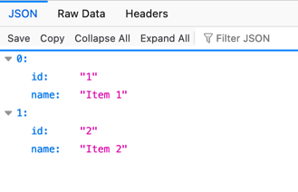

Just a hello world with gin.


## Run it:
 
Only is required execute `go run main.go`

You will see something like:

```
[GIN-debug] GET    /items                    --> main.main.func1 (3 handlers)
[GIN-debug] POST   /items                    --> main.main.func2 (3 handlers)
[GIN-debug] [WARNING] You trusted all proxies, this is NOT safe. We recommend you to set a value.
Please check https://pkg.go.dev/github.com/gin-gonic/gin#readme-don-t-trust-all-proxies for details.
[GIN-debug] Listening and serving HTTP on :8080

```

## Test it:

We can do it through three ways:

### A. Using webrowser 

Running `http://localhost:8080/items` 



### B. Through [CURL](https://curl.se/docs/manpage.html)

```
curl --request GET \
--url http://localhost:8080/items \
--header 'User-Agent: insomnia/10.2.0'
```
```
curl --request POST \
  --url http://localhost:8080/items \
  --header 'Content-Type: application/json' \
  --header 'User-Agent: insomnia/10.2.0' \
  --data '{
    "id": "4",
    "name": "The Modern Sound of Betty Carter"
}'
```


### C. Through [Insomnia](https://insomnia.rest/download)

Another app like Posman but with better look & feel ;) 

Just import the file inside of utils and use it 